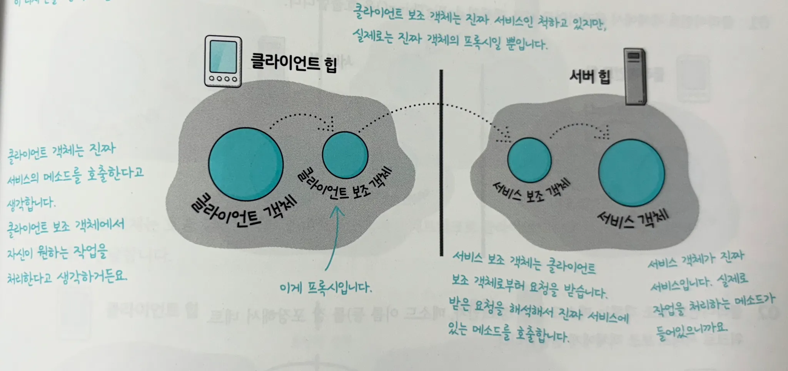

# ch 11.  프록시 패턴 : 객체 접근 제어하기
> **프록시 패턴(Proxy Pattern)은 특정 객체로의 접근을 제어하는 대리인을 제공한다.**


- 실제 업무를 처리하는 RealSubject 객체와 프록시 객체가 모두 똑같은 인터페이스를 구현
  → RealSubject 가 들어가야 할 자리에 Proxy를 대신 넣을 수 있다.
- `RealSubject` : 진짜 작업을 처리하는 객체
- `Proxy` : RealSubject 객체의 대변인. 이 객체로의 접근을 제어.

  RealSubject를 필드로 갖는다.


## 1️⃣ 원격 프록시 (remote proxy)

> RMI (Remote Method Invocation): 원격 객체로의 접근 제어 & 메서드 호출. 다른 JVM에 있는 원격 객체 사용법
>




RMI는 개발자가 보조 객체를 생성할 필요가 없도록 직접 클라이언트 보조객체와 서비스 보조 객체를 만들어준다.

- RMI에서 클라이언트 보조 객체는 스텁(stub), 서비스 보조 객체는 스켈레톤(skeleton) 이라고 부른다.
- 클라이언트 객체가 원격 객체와 직접 통신하는 것처럼 보이지만, 사실은 로컬에 있는 프록시 객체를 통해서 통신하고 있는 거다!

  (프록시 객체에서 네트워크 통신과 관련된 저수준 작업을 처리해준다.)


### 원격 서비스 만드는 방법

1. **원격 인터페이스 만들기**

   클라이언트가 원격으로 호출할 메서드 정의

    - Remote 인터페이스 상속받기
    - 모든 메서드가 RemoteException을 던지도록 선언한다.
    - 원격 메서드의 인자와 리턴값은 반드시 primitive type이나 Serializable 형식으로 선언해야 한다.

      (원시 형식이나 String, 컬렉션과 같은 자바 API는 사용 가능

      만약 직접 만든 객체를 전달하고 싶다면, 반드시 Serializable 인터페이스도 구현해야 한다.)

    - Serializable 인테페이스를 확장하면 해당 클래스의 인스턴스를 직렬화해서 네트워크로 전송할 수 있다.
    - transient 키워드를 사용하면 JVM에서 그 필드를 직렬화하지 않는다.
2. **서비스 구현 클래스 만들기**

   1번의 인터페이스 구현체 만들기

    - `UnicastRemoteObject` 클래스를 받아서 원격 서비스 객체 기능을 추가
    - 예외를 선언하는 생성자 구현
    - 서비스를 RMI 레즈스트리에 등록한다. 그래야 원격 서비스를 클라이언트에서 호출할 수 있다.
3. **PMI 레지스트리 실행하기**

   클라이언트는 이 레지스트리로부터 프록시(스텁)를 받아간다

    ```bash
    %rmregistry         // 터미널에서 rmiregistry 실행
    ```

4. **원격 서비스 실행하기**

   2번에서 구현한 클래스의 인스턴스를 RMI 레지스트리에 등록한다. → 그 서비스를 클라이언트에서 사용

    ```bash
    	%java MyRemoteImpl       // 다른 터미널에서 서비스 실행 
    			         // -> main 메서드에서 바로 객체 만들고 RMI 레지스트리에 등록
    ```
   (MyRemoteImpl 클래스 코드 참고)


클라이언트가 원격 서비스를 호출하기 위한 단계


1. 클라이언트 객체가 lookup() 메서드를 호출
2. 서버의 RMI 레지스트리가 등록되어 있던 stub을 반환한다
3. 클라이언트 객체가 해당 stub의 sayHello() 메서드를 호출
4. stub 객체가 원격 스켈레톤에게 요청 전달
5. 서버에서 요청 처리한 후 응답을 stub 객체에게 반환
6. stub이 응답을 클라이언트 객체에게 전달

(MyRemoteClient 클래스 코드 참고)


- 주의할 점
    1. 서비스를 등록하기 전에 RMI 레지스트리가 돌아가고 있어야 한다.
    2. 원격에서 `Naming.*bind*("remote", service);` 메서드를 통해 서비스를 등록해야 한다.
       (그래야 stub 객체가 생성됨)
    3. 클라이언트에서는 `*MyRemote* service = (*MyRemote*) Naming.*lookup*("rmi://127.0.0.1/remote");` 메서드를 통해 stub 객체를 가져와야 한다.
       (얘를 통해 실행할 수 있으므로)

⇒ 여기서 stub = 프록시 객체

프록시에 있는 메서드를 호출하면 프록시 객체가 원격 서버로 메서드 호출을 전달한다.

프록시를 사용하므로 클라이언트는 원격 호출을 하고 있다는 사실을 몰라도 된다.

## 2️⃣ 가상 프록시 (virtual proxy)

> 생성하기 힘든 자원으로의 접근 제어


- 생성하는 데 많은 비용이 드는 객체를 대신한다.

  진짜 객체가 필요한 상황이 오기 전까지 객체의 생성을 미루는 기능 제공

- ex. 앨범 커버 뷰어를 만들 때, 가상 프록시가 아이콘 대신 백그라운드에서 이미지 불러오는 작업 처리 & 이미지를 완전히 가져오기 전까지 “이미지를 불러오는 중입니다” 메시지 보여줌

## 3️⃣ 보호 프록시 (protection proxy)

> 접근 권한이 필요한 자원으로의 접근 제어
>

`java.lang.reflect` 패키지를 통해 동적 프록시 기술을 사용할 수 있다.


- Proxy : 자바에서 생성해주는 클래스
- InvocationHandler : Proxy 클래스가 무슨 일을 해야 하는지 알려주는 객체

⇒ Proxy가 메서드 호출을 받음 → 항상 InvocationHandler에게 진짜 작업을 부탁

- ex. 소개팅 어플에서 수정 관련 메서드는 회사 직원만 접근 가능하고 고객은 접근 불가능하다.
  반면 getter 메서드는 누구든 호출 가능하다.
    - 자신의 괴짜지수 조작 불가능 → 본인의 Person 객체에 접근하는 프록시 생성
    - 다른 고객의 개인정보 수정 불가능 → 다른 사람들의 Person 객체에 접근하는 프록시 생성

### 동적 프록시를 사용해서 보호 프록시 기능 구현하기

1. **2개의 InvocationHandler 객체 만들기**

   InvocationHandler = 프록시의 행동을 구현한 클래스

   본인용 핸들러, 타인용 핸들러 이렇게 2개의 호출 핸들러를 만들어야함

    1. `proxy.setGeekRating(9)` 메서드 호출
    2. 프록시는 InvocationHandler의 `invoke(Object proxy, Method method, Object[] args)` 메서드 호출
    3. InvocationHandler에서는 주어진 요청을 어떻게 처리할지 결정한 다음, 상황에 따라 RealSubject에 요청을 전달한다.

    ```java
    // 본인의 Person 객체에 접근하는 프록시의 행동을 정의해놓은 호출 핸들러
    public class OwnerInvocationHandler implements InvocationHandler { 
    	Person person;
     
    	public OwnerInvocationHandler(Person person) {
    		this.person = person;
    	}
     
    	public Object invoke(Object proxy, Method method, Object[] args) 
    			throws IllegalAccessException {
      
    		try {
    			if (method.getName().startsWith("get")) {    // 자신의 괴짜지수 조작 불가능
    				return method.invoke(person, args);
       			} else if (method.getName().equals("setGeekRating")) {
    				throw new IllegalAccessException();
    			} else if (method.getName().startsWith("set")) {
    				return method.invoke(person, args);
    			} 
            } catch (InvocationTargetException e) {
                e.printStackTrace();
            } 
    		return null;
    	}
    }
    ```

2. **동적 프록시 생성 코드 만들기**

   프록시 클래스를 생성하고 인스턴스를 만드는 코드 작성

3. **적절한 프록시로 Person 객체 감싸기**

    ```java
    	Person getOwnerProxy(Person person) {
            return (Person) Proxy.newProxyInstance( 
                	person.getClass().getClassLoader(),
                	person.getClass().getInterfaces(),
                    new OwnerInvocationHandler(person));
    	}
    ```


- **‘동적’** 프록시인 이유 : 프록시 클래스가 실행 중에 생성되기 때문이다. (실행 중 전달해 준 인터페이스로 즉석에서 클래스가 생성된다) `Proxy.newProxyInstance()`

## 4️⃣ 캐싱 프록시 (caching proxy)

> 기존에 생성했던 객체들을 캐시에 저장해 뒀다가, 요청이 들어왔을 때 캐시에 저장되어 있는 객체를 리턴
>
- 비용이 많이 드는 작업의 결과를 임시로 저장해준다.
- 여러 클라이언트에서 결과를 공유하게 해준다. → 계산 시간 ⬇️ , 네트워크 지연 ⬇️
- 웹 서버 프록시 또는 컨텐츠 관리 및 퍼블리싱 시스템에 자주 사용

## 5️⃣ 방화벽 프록시 (firewall proxy)

> 일련의 네트워크 자원으로의 접근을 제어 → 일을 하는 subject 객체를 나쁜 클라이언트로부터 보호
>
- 기업용 방화벽 시스템에 자주 사용

## 6️⃣ 스마트 레퍼런스 프록시 (smart reference proxy)

> subject가 참조될 때마다 추가 행동을 제공한다.
>

ex. 객체의 레퍼런스 개수를 세는 기능 제공

## 7️⃣ 동기화 프록시 (synchronization proxy)

> 여러 스레드에서 주제에 접근할 때 안전하게 작업을 처리할 수 있도록 해준다.
>
- 분산 환경에서 일련의 객체로의 동기화된 접근을 제어해주는 자바 스페이스에서 사용

## 8️⃣ 퍼사드 프록시 (facade proxy)

> = 복잡도 숨김 프록시 (complexity hiding proxy)
복잡한 클래스의 집합으로의 접근을 제어하고 그 복잡도를 숨겨준다.
>
- 퍼사드 패턴과의 차이점 : 프록시는 접근을 제어하지만, 퍼사드 패턴은 대체 인터페이스만 제공한다.

## 9️⃣ 지연 복사 프록시 (copy-on-write proxy)

> 클라이언트에서 필요로 할 때까지 객체가 복사되는 것을 지연시킨다. (변형된 가상 프록시)
>
- 자바의 CopyOnWriteArrayList 에서 사용된다.

- 데코레이터 패턴 🆚 프록시 패턴
    - 데코레이터는 클래스에 새로운 행동을 추가하는 용도로 사용
    - 프록시는 어떤 클래스로의 접근을 제어하는 용도로 사용 (**대리인**)

      원격 프록시 → 원격에 있는 객체를 대변한다 (감싸는거X)

      가상 프록시 → 아직 생성되지 않는 객체를 대변한다 (감쌀 객체가 존재X)

- 어댑터 패턴 🆚 프록시 패턴
    - 어댑터는 다른 객체의 인터페이스를 바꿔준다
    - 프록시는 똑같은 인터페이스를 사용한다
- 프록시 패턴을 적용하기 위해서 팩토리 메서드를 사용하는 것 추천

  팩토리 메서드 내에서 `객체 생성 → 프록시로 감싸서 리턴` ⇒ 클라이언트는 프록시 객체를 사용하는지 전혀 알지 못한다.
